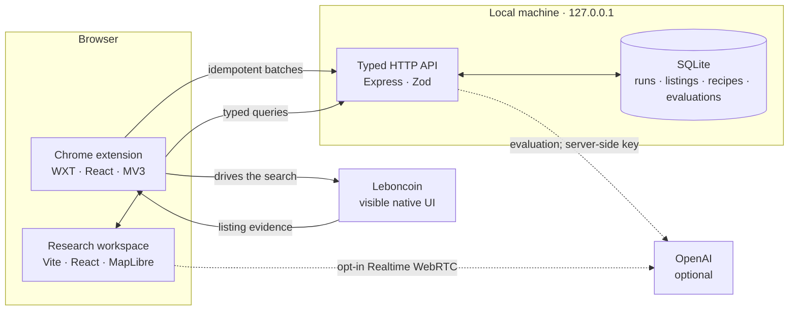

<p align="center">
  
</p>

<h1 align="center">dénicheur·breizh</h1>

<p align="center">
  <strong>Turn a property search into an evidence trail.</strong>
  <br>
  A local-first workspace for capturing, mapping, comparing, and evaluating real-estate listings.
</p>

<p align="center">
  
  
  
  
  
</p>

<p align="center">
  <a href="#what-it-does">What it does</a> ·
  <a href="#architecture">Architecture</a> ·
  <a href="#quick-start">Quick start</a> ·
  <a href="#chrome-extension">Extension</a> ·
  <a href="#quality-gates">Quality gates</a>
</p>

---

## What it does

dénicheur·breizh is a private, single-user research cockpit built around a simple loop:

<p align="center">
  <strong>Search → Capture → Sync → Map → Score → Decide</strong>
</p>

| | Capability | What you get |
|---|---|---|
| 🔎 | **Guided capture** | A Chrome MV3 extension drives a visible, native Leboncoin search and collects listing details with conservative pacing. |
| 🗺️ | **A spatial workspace** | Explore properties on a MapLibre map, filter by source and property type, and inspect coordinate provenance. |
| 🧭 | **A decision surface** | Switch between sortable tables and cards, open rich listing details, and compare run history and evaluations. |
| 🎛️ | **Your scoring logic** | Create, version, validate, and activate weighted evaluation recipes instead of burying preferences in a prompt. |
| ✨ | **Optional AI evaluation** | Score listings against evidence-backed criteria through OpenAI without exposing the API key to the extension or web app. |
| 🌍 | **Three languages** | Use the web workspace and extension in French, Spanish, or English, with light and dark themes. |

The project is intentionally a local application, not a hosted SaaS. SQLite, the API, and your research history stay on your machine unless you explicitly enable an OpenAI-backed feature.

## Architecture



The local API is the only owner of SQLite. Browser clients never open the database file, and listing evaluation credentials never leave the API process. The extension uses `chrome.storage.local` as an offline buffer and synchronizes to the API in batches of at most 20.

### Design principles

- **Local by default.** The unauthenticated API binds to `127.0.0.1:4310` and is not designed for public exposure.
- **Evidence over guesses.** Listings retain run observations, coordinate provenance, evaluation evidence, and immutable evaluation history.
- **Failure-safe collection.** A failed sync or AI evaluation never deletes a captured listing.
- **Versioned decisions.** Scoring recipes are explicit, validated, and versioned; one version can be active at a time.
- **Respectful automation.** The extension does not bypass access controls. CAPTCHA requires a human, and restriction screens stop the run.

## Quick start

### Requirements

| Tool | Version |
|---|---|
| Node.js | `>=24 <27` |
| pnpm | `11.1.3` |
| Google Chrome | `116+` for the extension |

Install the workspace:

```bash
pnpm install
```

Start the API and web workspace:

```bash
pnpm dev
```

Then open [http://127.0.0.1:5173](http://127.0.0.1:5173). The API health endpoint is available at [http://127.0.0.1:4310/health](http://127.0.0.1:4310/health).

In a second terminal, start the extension watcher:

```bash
pnpm dev:extension
```

For an unpacked installation, open `chrome://extensions`, enable **Developer mode**, choose **Load unpacked**, and select `apps/extension/.output/chrome-mv3-dev` after WXT has generated it.

> [!TIP]
> The core workspace works without OpenAI. Add a key only when you want AI listing evaluation or the optional voice experiment.

### Optional configuration

The defaults work locally without environment files. To configure OpenAI or override the API settings:

```bash
cp apps/api/.env.example apps/api/.env
```

Set `OPENAI_API_KEY` in `apps/api/.env`. The key is read only by the API and must never use a `VITE_` or `WXT_` prefix.

<details>
<summary><strong>Environment variables</strong></summary>

| Variable | Default | Purpose |
|---|---|---|
| `OPENAI_API_KEY` | unset | Enables listing evaluation and Realtime session creation. |
| `OPENAI_FILTER_MODEL` | pinned in `apps/api/.env.example` | Selects the server-side evaluation model. |
| `FILTER_API_PORT` | `4310` | Changes the localhost API port. |
| `DENICHEUR_DB_PATH` | `.data/denicheur.sqlite` | Changes the private SQLite path; use `:memory:` for isolated runs. |
| `FILTER_API_ALLOWED_ORIGINS` | local web + pinned extension | Replaces the exact CORS allowlist. |
| `VITE_API_BASE_URL` | `http://127.0.0.1:4310` | Points the web client at the API. |
| `VITE_ENABLE_REALTIME` | `false` | Reveals the experimental voice workspace. |
| `WXT_FILTER_API_URL` | `http://127.0.0.1:4310` | Points the extension at the API. |

</details>

## The workspace

The web app is organized around four primary views:

- **Map** — MapLibre visualization, source and property-type filters, selection details, and explicit mapped/unmapped coverage.
- **Properties** — sortable table and card layouts with source filters, canonical details, run provenance, and evaluation history.
- **Scorings** — inspect evaluation results and understand how each criterion contributed to a decision.
- **Builder** — create immutable recipe versions, tune weighted criteria and thresholds, then activate a version for the extension.

An experimental fifth view, **Voice**, can be enabled with `VITE_ENABLE_REALTIME=true`. It creates a Spanish-to-French WebRTC interpreter using OpenAI Realtime. The API creates and authenticates the upstream session; the browser never receives the API key.

## Chrome extension

The extension turns a repeatable native search into structured local evidence:

1. It opens and owns the Leboncoin tabs required for the run.
2. It fills the visible native search form and follows native pagination.
3. It checkpoints every observed page and deduplicates canonical listing IDs.
4. It optionally opens detail pages sequentially to collect richer fields.
5. It buffers progress in `chrome.storage.local` and synchronizes idempotently to the API.

The crawler is deliberately paced and sequential. It may accept one unambiguous cookie banner, but it will not evade site controls:

- unavailable optional filters become warnings;
- CAPTCHA pauses until the user solves it and chooses **Resume**;
- DataDome, temporary restriction, or unusual activity produces a terminal `blocked-activity` state;
- restriction pages are never reloaded or retried automatically.

### Stable production build

Build the extension once:

```bash
pnpm --filter @denicheur-breizh/extension build
```

Load `apps/extension/.output/chrome-mv3` in `chrome://extensions`. This build contains the pinned extension identity expected by the default API allowlist and does not require a watcher.

To clear only the extension's local iteration data while preserving filters, language, theme, and API-persisted listings:

```bash
pnpm db:clean
```

Manual acceptance procedures:

- [Conservative one-listing smoke test](tests/manual/leboncoin-one-listing-smoke.md)
- [Long multipage smoke test](tests/manual/leboncoin-seventy-listing-smoke.md)

## Data and AI boundaries

| Mode | Network behavior |
|---|---|
| Core workspace | Web app and extension talk to the API over localhost; the extension talks to Leboncoin only during a user-started collection. |
| AI evaluation | The API sends the requested recipe and normalized listing evidence to OpenAI, validates the response, and stores the result locally. |
| Realtime voice | The browser joins an explicitly started OpenAI WebRTC session; the API authenticates session creation without revealing the key. |

Re-ingesting the same `source + externalId` is idempotent. Sparse, newer observations do not erase richer earlier fields, and evaluation failure never blocks persistence. See the [API reference](apps/api/README.md) for endpoints, contracts, migrations, and configuration details.

## Quality gates

```bash
pnpm check          # typecheck + design tokens + unit/integration tests + production builds
pnpm test:e2e       # deterministic web/API/MV3/SQLite E2E with sanitized fixtures
pnpm test:coverage  # per-package Vitest coverage summaries
pnpm check:all      # complete deterministic gate: check + E2E
```

The deterministic E2E suite runs against the real built Chrome extension, HTTP API, SQLite persistence, and web app without spending OpenAI credits.

The opt-in live AI test makes a real OpenAI request using the ignored root `.env`:

```bash
pnpm test:e2e:live
```

This validates the OpenAI-backed extension → API → storage path. It is separate from the manual live-site smoke tests above.

## Repository map

```text
denicheur-breizh/
├── apps/
│   ├── api/             # localhost Express API, SQLite, OpenAI boundary
│   ├── extension/       # WXT + React Chrome MV3 extension
│   └── web/             # Vite + React research workspace
├── packages/
│   ├── contracts/       # shared Zod wire contracts
│   ├── design-system/   # tokens, CSS, and React primitives
│   └── i18n/            # shared FR / ES / EN domain messages
├── scripts/             # local maintenance utilities
└── tests/
    ├── e2e/             # Playwright web + extension flows
    └── manual/          # conservative live-site acceptance procedures
```

Built with React 19, TypeScript, Vite, WXT, Express, SQLite, Zod, TanStack Query, Zustand, MapLibre, Vitest, Playwright, and Turborepo.

---

<p align="center">
  <sub>Local data. Explicit evidence. Better property decisions.</sub>
</p>
