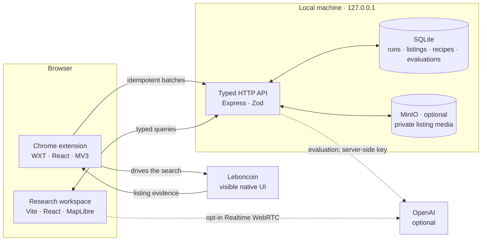

<p align="center">
  
</p>

<h1 align="center">dénicheur·breizh</h1>

<p align="center">
  <strong>Turn a property search into an evidence trail.</strong>
  <br>
  A local-first workspace for capturing, mapping, comparing, and evaluating real-estate listings.
</p>

<p align="center">
  
  
  
  
  
</p>

<p align="center">
  <a href="#what-it-does">What it does</a> ·
  <a href="#architecture">Architecture</a> ·
  <a href="#quick-start">Quick start</a> ·
  <a href="#chrome-extension">Extension</a> ·
  <a href="#quality-gates">Quality gates</a>
</p>

---

## What it does

dénicheur·breizh is a private, single-user research cockpit built around a simple loop:

<p align="center">
  <strong>Search → Capture → Sync → Map → Score → Decide</strong>
</p>

| | Capability | What you get |
|---|---|---|
| 🔎 | **Guided capture** | A Chrome MV3 extension drives a visible, native Leboncoin search and collects listing details with conservative pacing. |
| 🗺️ | **A spatial workspace** | Explore properties on a MapLibre map, filter by source and property type, and inspect coordinate provenance. |
| 🧭 | **A decision surface** | Switch between sortable tables and cards, open rich listing details, and compare run history and evaluations. |
| 🎛️ | **Your scoring logic** | Create, version, validate, and activate weighted evaluation recipes instead of burying preferences in a prompt. |
| ✨ | **Optional AI evaluation** | Score listings against evidence-backed criteria through OpenAI without exposing the API key to the extension or web app. |
| 🌍 | **Three languages** | Use the web workspace and extension in French, Spanish, or English, with light and dark themes. |

The project is intentionally a local application, not a hosted SaaS. SQLite, the API, and your research history stay on your machine unless you explicitly enable an OpenAI-backed feature.

## Architecture



The local API is the only owner of SQLite. Browser clients never open the database file, and listing evaluation credentials never leave the API process. The extension uses `chrome.storage.local` as an offline buffer and synchronizes to the API in batches of at most 20.

### Design principles

- **Local by default.** The unauthenticated API binds to `127.0.0.1:4310` and is not designed for public exposure.
- **Evidence over guesses.** Listings retain run observations, coordinate provenance, evaluation evidence, and immutable evaluation history.
- **Failure-safe collection.** A failed sync or AI evaluation never deletes a captured listing.
- **Versioned decisions.** Scoring recipes are explicit, validated, and versioned; one version can be active at a time.
- **Respectful automation.** The extension does not bypass access controls. CAPTCHA requires a human, and restriction screens stop the run.

## Quick start

### Requirements

| Tool | Version |
|---|---|
| Node.js | `>=24 <27` |
| pnpm | `11.17.0` |
| Google Chrome | `116+` for the extension |

Install the workspace:

```bash
pnpm install
```

Start the API and web workspace:

```bash
pnpm dev
```

Then open [http://127.0.0.1:5173](http://127.0.0.1:5173). The API's public minimal health endpoint is available at [http://127.0.0.1:4310/health](http://127.0.0.1:4310/health); the local dashboard uses `/v1/health/details` for operational status.

In a second terminal, start the extension watcher:

```bash
pnpm dev:extension
```

For an unpacked installation, open `chrome://extensions`, enable **Developer mode**, choose **Load unpacked**, and select `apps/extension/.output/chrome-mv3-dev` after WXT has generated it.

> [!TIP]
> The core workspace works without OpenAI. Add a key only when you want AI listing evaluation or the optional voice experiment.

### Optional configuration

The defaults work locally without environment files. To configure OpenAI or override the API settings:

```bash
cp apps/api/.env.example apps/api/.env
```

Set `OPENAI_API_KEY` in `apps/api/.env`. The key is read only by the API and must never use a `VITE_` or `WXT_` prefix.

<details>
<summary><strong>Environment variables</strong></summary>

| Variable | Default | Purpose |
|---|---|---|
| `NODE_ENV` | `development` | Enables fail-closed production startup validation when set to `production`. |
| `API_REPLICA_COUNT` | `1` outside production | Production requires an explicit value of `1`; multiple API replicas remain unsupported while delivery budgets are process-local. Collected-data cleanup itself is fenced durably in SQLite. |
| `OPERATOR_TOKEN` | unset | Required in production; authenticates every API read/mutation except health and CORS preflight. |
| `OPENAI_API_KEY` | unset | Enables server-side listing evaluation; Realtime also requires the separate local-only opt-in below. |
| `OPENAI_FILTER_MODEL` | pinned in `apps/api/.env.example` | Selects the server-side evaluation model. |
| `OPENAI_INPUT_PRICE_MICRO_USD_PER_MILLION_TOKENS` / `OPENAI_OUTPUT_PRICE_MICRO_USD_PER_MILLION_TOKENS` | `0` | Operator-maintained pricing used for evaluation cost budgets; production with an OpenAI key requires explicit non-zero values. |
| `OPENAI_GLOBAL_BUDGET_WINDOW_MS` | `60000` | Rolling SQLite-backed window for every Responses API call; reservations survive API restarts. |
| `OPENAI_GLOBAL_MAX_PROVIDER_CALLS` / `OPENAI_GLOBAL_MAX_INPUT_TOKENS` / `OPENAI_GLOBAL_MAX_OUTPUT_TOKENS` | `200` / `1000000` / `1000000` | Provider-call and token ceilings across durable and synchronous evaluation routes. |
| `OPENAI_GLOBAL_MAX_COST_MICRO_USD` | `3000000` | Maximum estimated/consumed Responses API cost per global window (`3 USD`). |
| `OPENAI_REALTIME_ENABLED` | `false` | Local-only Realtime server opt-in; production rejects `true` because complete session usage cannot be metered here. |
| `EVALUATION_MAX_PROVIDER_CALLS` / `EVALUATION_MAX_INPUT_TOKENS` / `EVALUATION_MAX_OUTPUT_TOKENS` | `200` / `1000000` / `1000000` | Server ceilings for one durable evaluation execution. |
| `EVALUATION_MAX_COST_MICRO_USD` | `3000000` | Maximum estimated/consumed cost per execution (`3 USD`). |
| `FILTER_API_HOST` | `127.0.0.1` | Bind address; use `0.0.0.0` only inside an authenticated container/network boundary. |
| `FILTER_API_PORT` | `4310` | Changes the localhost API port. |
| `DENICHEUR_DB_PATH` | `.data/denicheur.sqlite` | Private SQLite path; production must mount it on persistent storage and rejects `:memory:`. |
| `FILTER_API_ALLOWED_ORIGINS` | local web + pinned extension | Replaces the exact CORS allowlist. |
| `MEDIA_STORAGE_MODE` | `disabled` | Enables asynchronous image mirroring when set to `minio`; production requires it. |
| `MEDIA_S3_ENDPOINT` | unset | S3-compatible endpoint; production requires HTTPS, while local Compose uses `http://127.0.0.1:9000`. |
| `MEDIA_S3_BUCKET` | unset | Private media bucket; the provided bootstrap creates `denicheur-breizh-media`. |
| `MEDIA_S3_REGION` | unset | S3 signing region; local MinIO uses `us-east-1`. |
| `MEDIA_S3_ACCESS_KEY_ID` / `MEDIA_S3_SECRET_ACCESS_KEY` | unset | Server-only media credentials; the example values are local-development defaults. |
| `MEDIA_S3_FORCE_PATH_STYLE` | `true` | Uses path-style requests for MinIO compatibility. |
| `MEDIA_MAX_ASSETS_PER_RUN` / `MEDIA_MAX_PENDING_JOBS` | `500` / `1000` | Admission ceilings for distinct run assets and queued work. |
| `MEDIA_MAX_RESERVED_BYTES` / `MEDIA_RESERVED_BYTES_PER_ASSET` | `5368709120` / `20971520` | Total media capacity budget and initial reservation per asset; actual staged bytes are re-admitted before upload. |
| `MEDIA_DELIVERY_RATE_LIMIT_MAX` / `MEDIA_DELIVERY_MAX_CONCURRENT` / `MEDIA_DELIVERY_MAX_BYTES_PER_MINUTE` | `120` / `8` / `268435456` | Request, concurrency, and byte budgets for API-served media. |
| `VITE_API_BASE_URL` | `http://127.0.0.1:4310` locally; `/api` in the production image | Points the browser at the API. `Dockerfile.web` rejects any production-image value other than the same-origin `/api`. |
| `VITE_ENABLE_REALTIME` | `false` | Reveals the experimental voice workspace; the local API must also opt in with `OPENAI_REALTIME_ENABLED=true`. |
| `WEB_API_UPSTREAM` | unset | Required by the production web container; private HTTP(S) origin such as `http://api:4310`, without credentials or a path. |
| `WEB_OPERATOR_TOKEN_FILE` | unset | Required absolute path to the operator-token secret mounted read-only in the web container. The token is never a build argument or browser variable. |
| `WEB_GATEWAY_AUTH_TOKEN_FILE` | unset | Required absolute path to a separate high-entropy token shared only with the trusted VPN/SSO ingress. It must not reuse the operator token. |
| `WEB_API_CA_FILE` | system CA bundle | Optional absolute CA-bundle path used with an HTTPS API upstream; certificate verification cannot be disabled. |
| Extension API URL / operator token | local runtime storage | Configured in the extension dashboard; never embedded in its build. |

</details>

### Optional local media mirror

To keep listing images in the private local MinIO bucket, copy the API example environment, enable its media mode, and start the dedicated Compose project:

```bash
cp apps/api/.env.example apps/api/.env
# In apps/api/.env, set MEDIA_STORAGE_MODE=minio.
docker compose --env-file apps/api/.env -f compose.media.yml up -d
docker compose --env-file apps/api/.env -f compose.media.yml ps -a
pnpm dev
```

MinIO serves its S3 API at [http://127.0.0.1:9000](http://127.0.0.1:9000) and its local console at [http://127.0.0.1:9001](http://127.0.0.1:9001); both published ports are bound to loopback only. The bootstrap service exits successfully after creating the private `denicheur-breizh-media` bucket and a user restricted to listing, reading, writing, and deleting objects in that bucket. Re-running the command is safe and preserves objects in the named volume.

The extension still sends the original Leboncoin URLs. Ingestion returns without waiting for downloads; the API worker validates and stores each original plus 480 px and 1280 px WebP variants. The web app uses API-served variants when ready and keeps the source URL as a temporary fallback. `pnpm db:clean` removes mirrored objects before clearing SQLite and fails safely with `503` if MinIO cannot be reached.

Once the local MinIO Compose project is healthy, its real S3 integration suite is explicitly opt-in:

```bash
pnpm --filter @denicheur-breizh/api test:integration:minio
```

The command loads the configured local `MEDIA_S3_*` values and refuses non-loopback endpoints. Regular test runs skip this suite without contacting MinIO.

Stop the service without deleting stored media:

```bash
docker compose --env-file apps/api/.env -f compose.media.yml down
```

## The workspace

The web app is organized around four primary views:

- **Map** — MapLibre visualization, source and property-type filters, selection details, and explicit mapped/unmapped coverage.
- **Properties** — sortable table and card layouts with source filters, canonical details, run provenance, and evaluation history.
- **Scorings** — inspect evaluation results and understand how each criterion contributed to a decision.
- **Builder** — create immutable recipe versions, tune weighted criteria and thresholds, then activate a version for the extension.

An experimental fifth view, **Voice**, can be enabled locally with `VITE_ENABLE_REALTIME=true` and `OPENAI_REALTIME_ENABLED=true`. It creates a Spanish-to-French WebRTC interpreter using OpenAI Realtime. The API creates and authenticates the upstream session; the browser never receives the API key. Production rejects this mode because session creation alone cannot meter the complete downstream usage.

## Chrome extension

The extension turns a repeatable native search into structured local evidence:

1. It opens and owns the Leboncoin tabs required for the run.
2. It fills the visible native search form and follows native pagination.
3. It checkpoints every observed page and deduplicates canonical listing IDs.
4. It optionally opens detail pages sequentially to collect richer fields.
5. It buffers progress in `chrome.storage.local` and synchronizes idempotently to the API.

The crawler is deliberately paced and sequential. It may accept one unambiguous cookie banner, but it will not evade site controls:

- unavailable optional filters become warnings;
- CAPTCHA pauses until the user solves it and chooses **Resume**;
- DataDome, temporary restriction, or unusual activity produces a terminal `blocked-activity` state;
- restriction pages are never reloaded or retried automatically.

### Stable production build

Build the extension once:

```bash
pnpm --filter @denicheur-breizh/extension build
```

Load `apps/extension/.output/chrome-mv3` in `chrome://extensions`. This build contains the pinned extension identity expected by the default API allowlist and does not require a watcher.

To clear the extension iteration, its pending synchronization state, and the live API SQLite rendered by the web app while preserving filters, recipes, language, and theme:

```bash
pnpm db:clean
```

The API must be running and Chrome must have the current unpacked build loaded. The reset holds the crawler's exclusive lease, waits for any in-flight extension sync, refuses to race a live collection, and only reports success after both stores are empty. Its internal 15-second deadline finishes before the CLI timeout, so a timed-out command cannot start a late cleanup.

To clear only the extension's local iteration data while preserving API-persisted listings:

```bash
pnpm db:clean:extension
```

Manual acceptance procedures:

- [Conservative one-listing smoke test](tests/manual/leboncoin-one-listing-smoke.md)
- [Long multipage smoke test](tests/manual/leboncoin-seventy-listing-smoke.md)

## Data and AI boundaries

| Mode | Network behavior |
|---|---|
| Core workspace | Web app and extension talk to the API over localhost; the extension talks to Leboncoin only during a user-started collection. |
| AI evaluation | The API sends the requested recipe and normalized listing evidence to OpenAI, validates the response, and stores the result locally. |
| Media mirror | The API downloads allowlisted Leboncoin CDN images and stores originals plus WebP variants in the private MinIO bucket; browsers receive them through API routes. |
| Realtime voice | Local opt-in only: the browser joins an explicitly started OpenAI WebRTC session; the API authenticates session creation without revealing the key. Production disables it. |

Re-ingesting the same `source + externalId` is idempotent. Sparse, newer observations do not erase richer earlier fields, and evaluation failure never blocks persistence. See the [API reference](apps/api/README.md) for endpoints, contracts, migrations, and configuration details.

## Production hardening and image evidence

`NODE_ENV=production` is fail-closed: the API requires a high-entropy operator token, an explicit `API_REPLICA_COUNT=1`, complete private MinIO configuration over HTTPS, and `MEDIA_STORAGE_MODE=minio`; it also refuses Realtime. Every `/v1` read and mutation then requires the Bearer token; only CORS preflight plus `GET`/`HEAD /health` remain public. Public readiness returns `503` when SQLite or configured media storage is unavailable. If OpenAI is enabled, production startup also requires explicit non-zero input/output pricing so the global and per-execution cost ceilings are meaningful. The exact [evaluation](apps/api/README.md#evaluation-resource-budgets) and [media](apps/api/README.md#media-admission-and-delivery-budgets) budget semantics are documented in the API reference.

The production web image now owns two distinct authenticated boundaries. Its browser bundle is hard-wired to same-origin `/api`; at container startup nginx reads the ingress proof from `WEB_GATEWAY_AUTH_TOKEN_FILE` and the API service identity from `WEB_OPERATOR_TOKEN_FILE`, requires them to be different, and validates `WEB_API_UPSTREAM`. Every request, including static dashboard paths and `/api/*`, must present the exact ingress proof; only `/healthz` remains public for container liveness. After that check succeeds, nginx injects the operator `Authorization: Bearer …` only on the private API hop. Client-supplied authorization, origin, cookies, referer and ingress-proof headers are not forwarded, and credential-like upstream response headers are hidden. The container refuses to start when a secret, upstream, token syntax, port, or HTTPS CA bundle is invalid. Local Vite remains direct and tokenless at `http://127.0.0.1:4310`; the isolated E2E bundle remains at `http://127.0.0.1:14310`.

Mount the same operator secret configured on the API and a separate gateway token as read-only files. Never place either secret in a `VITE_` variable, Docker build argument, image layer, command-line flag, or repository file. A production orchestrator must provide, at minimum:

```text
WEB_API_UPSTREAM=http://api:4310
WEB_OPERATOR_TOKEN_FILE=/run/secrets/denicheur-operator-token
WEB_GATEWAY_AUTH_TOKEN_FILE=/run/secrets/denicheur-gateway-auth-token
```

The operator token is a service identity, not a user session. The VPN/SSO ingress must authenticate every dashboard request, remove any client-supplied `X-Denicheur-Ingress-Token`, then set that header to the gateway token before proxying to the web container. Never expose container port `8080` through a route that bypasses that ingress. Use an HTTPS upstream whenever the API hop crosses a network that is not already isolated and trusted; the gateway verifies `WEB_API_CA_FILE` and offers no TLS downgrade switch.

Use `pnpm --filter @denicheur-breizh/web test:container` to build the real image and verify the fail-closed startup cases, rendered nginx configuration, and absence of secret configuration names from the served bundle. See [the web runtime reference](apps/web/README.md) for the deployment contract.

Container publication runs only for protected branches or tags and requires three externally managed GitLab CI/CD variables:

- `COSIGN_PRIVATE_KEY_FILE` — a protected **File** variable containing an encrypted, externally provisioned Cosign private key, scoped to the `cosign-signing` environment;
- `COSIGN_PUBLIC_KEY_FILE` — a protected **File** variable containing the matching public key;
- `COSIGN_PASSWORD` — a protected, masked/hidden variable containing the private-key decryption password, also scoped to `cosign-signing`.

The canonical push and pull endpoint is `registry.orchid-labs.xyz:32443`; both Kaniko and Cosign validate its public TLS chain and hostname using their system trust by default. If a future runner path genuinely needs an additional trust anchor, configure `REGISTRY_INTERNAL_CA_FILE` as an optional protected **File** variable containing a PEM CA bundle. Kaniko appends that bundle to system trust and Cosign supplies it through `--registry-cacert`; neither tool has a TLS bypass.

All jobs inherit the `denicheur-breizh-ci` resource group, so this project's pipelines remain serial. Each job is capped at 1000m CPU plus a 100m helper: even while Kubernetes is still terminating the previous pod, the two 1100m reservations remain below the shared runner namespace's 2500m quota instead of failing before the script starts.

The repository never generates or stores signing material. Provision and rotate that key pair through the infrastructure's secret-management process, scope the private key and password to `cosign-signing`, restrict protected-ref pipelines to trusted maintainers, and never expose private signing material to merge-request or unprotected-branch pipelines. Protect the `cosign-signing` environment as an additional control when the GitLab tier supports protected environments. Only `sign-image-provenance` declares that environment; validation, build and verification jobs fail immediately if the private key or password is mistakenly configured with a broader environment scope.

After externally generating a temporary directory containing `cosign.key`, `cosign.pub` and a single-line `password`, provision the variables with `node scripts/ci/provision-gitlab-cosign.mjs --material-dir <directory>`. The private key and password files must be mode `0600`. The helper refuses overwrites, passes values only through mode-`0600` temporary JSON files, suppresses API bodies, removes debug tracing, rolls back partial variable creation, and removes its payload directory. Run `node scripts/ci/test-provision-gitlab-cosign.mjs` first to exercise the fake-`glab` leak and rollback harness. Remove the external material directory through its approved custody workflow after live metadata confirms the three variables.

For each `api` or `web` image, Kaniko publishes revision and pipeline tags but hands subsequent jobs only the canonical digest reference (`registry/repository@sha256:...`), digest, and build-job ID. `sign-image-provenance` then:

1. validates the protected project/ref identity, optional additional registry CA, encrypted private key and matching public key;
2. reads the immutable subject from the registry and stores a Cosign signature there with exact project, revision, pipeline, build-job, image and builder annotations;
3. stores a signed `https://slsa.dev/provenance/v1` attestation in the registry, binding the same digest to the source revision, Dockerfile, pipeline invocation and digest-pinned Kaniko builder.

`verify-image-cryptography` has no private key. It reads each digest back through `REGISTRY_PULL_HOST`, validates the registry-backed signature and SLSA attestation against `COSIGN_PUBLIC_KEY_FILE`, and requires the exact signed annotations. `verify-image-provenance` then decodes the already verified DSSE envelope and fail-closes unless its subject, digest, project, revision, pipeline, distinct build-job IDs, Dockerfile and builder are exact. Only that final job publishes `verified-images.env` with `API_IMAGE` and `WEB_IMAGE`.

The repository currently has no deploy or promotion job. The deterministic CI policy harness uses a closed allowlist for the current stages and jobs. Any future promotion job must run in an explicitly declared stage after `provenance`, reuse the protected-ref image rules, download `verify-image-provenance` artifacts, and consume both `API_IMAGE` and `WEB_IMAGE`; unreviewed includes, stages, or jobs fail closed. The harness also rejects mutable image references, unpinned CI tool images, registry TLS bypasses, in-repository key generation, missing signature/attestation commands, and several provenance tampering cases.

The private key is the configured trust anchor and signatures are intentionally not sent to the public Rekor service. Key custody, rotation and audit therefore remain infrastructure responsibilities. A green pipeline proves publication, registry read-back, cryptographic identity and predicate consistency; it does not prove that an image was subsequently deployed.

The CI builder, Cosign verifier and Node/Nginx Docker stages retain readable version tags but are locked to reviewed multi-platform manifest digests.

## Quality gates

```bash
pnpm check          # typecheck + design tokens + unit/integration tests + production builds
pnpm test:e2e       # deterministic web/API/MV3/SQLite E2E with sanitized fixtures
pnpm test:coverage  # per-package Vitest coverage summaries
pnpm check:all      # complete deterministic gate: check + E2E
```

The deterministic E2E suite runs against the real built Chrome extension, HTTP API, SQLite persistence, and web app without spending OpenAI credits.

The opt-in live AI test makes a real OpenAI request using the ignored root `.env`:

```bash
pnpm test:e2e:live
```

This validates the OpenAI-backed extension → API → storage path. It is separate from the manual live-site smoke tests above.

## Repository map

```text
denicheur-breizh/
├── compose.media.yml    # optional private MinIO + idempotent bucket bootstrap
├── apps/
│   ├── api/             # localhost Express API, SQLite, OpenAI boundary
│   ├── extension/       # WXT + React Chrome MV3 extension
│   └── web/             # Vite + React research workspace
├── packages/
│   ├── contracts/       # shared Zod wire contracts
│   ├── design-system/   # tokens, CSS, and React primitives
│   └── i18n/            # shared FR / ES / EN domain messages
├── scripts/             # local maintenance utilities
└── tests/
    ├── e2e/             # Playwright web + extension flows
    └── manual/          # conservative live-site acceptance procedures
```

Built with React 19, TypeScript, Vite, WXT, Express, SQLite, Zod, TanStack Query, Zustand, MapLibre, Vitest, Playwright, and Turborepo.

---

<p align="center">
  <sub>Local data. Explicit evidence. Better property decisions.</sub>
</p>
