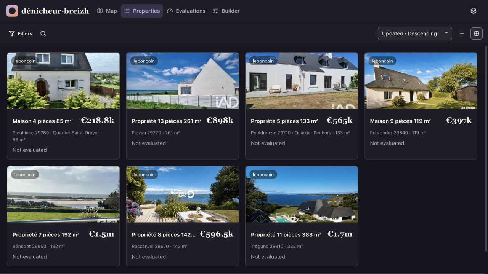
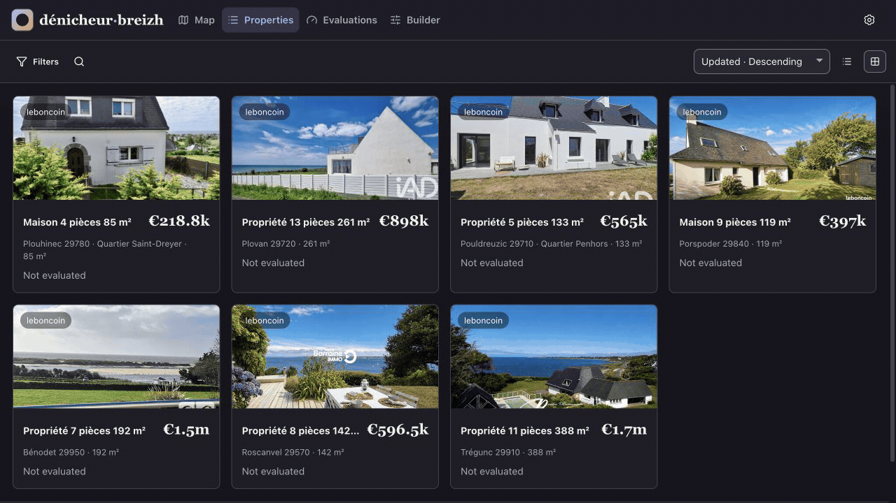
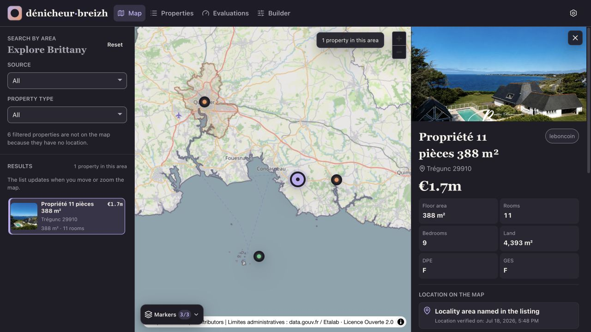
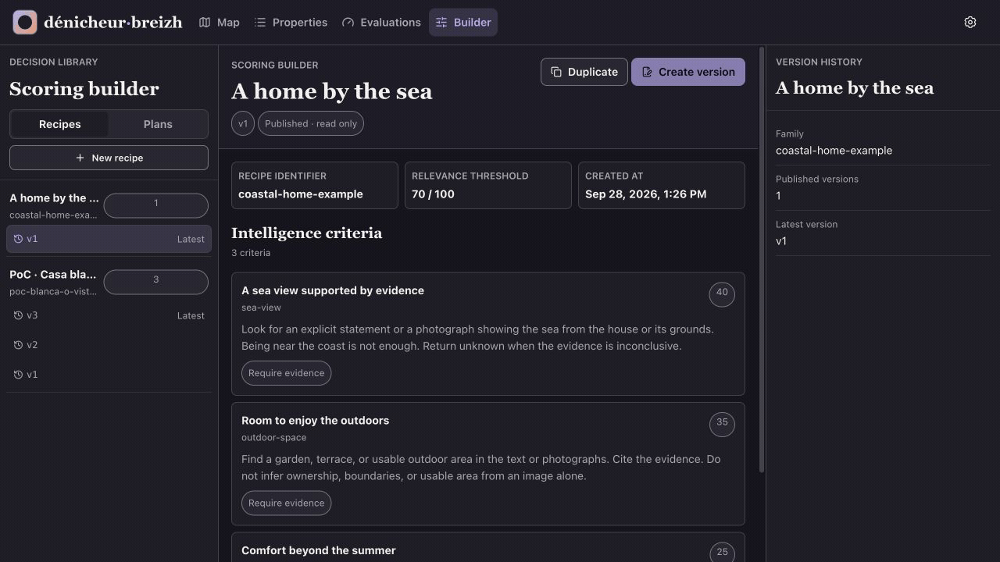
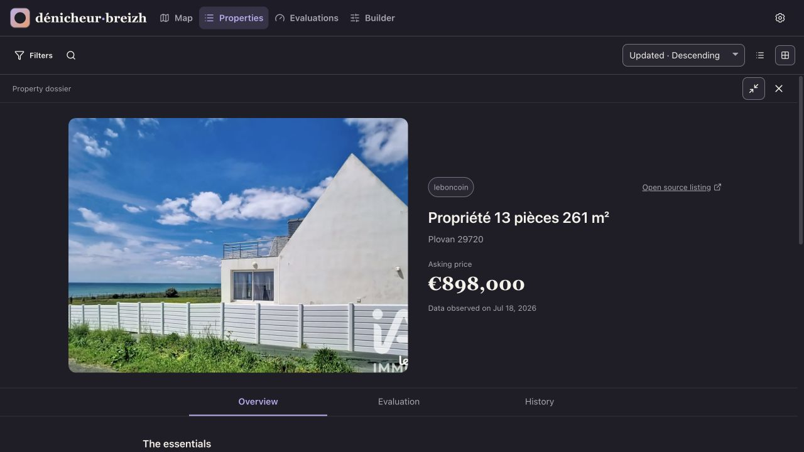
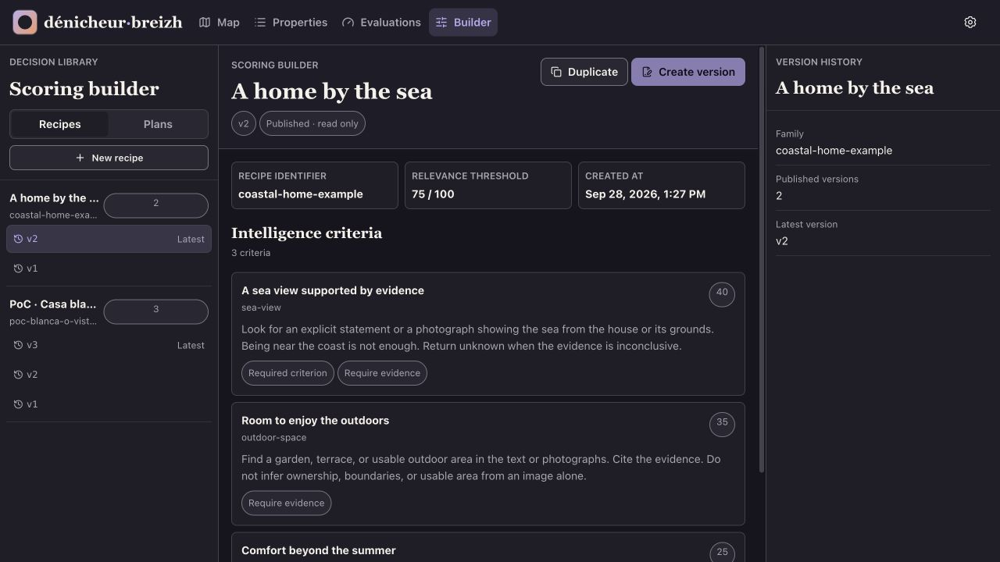
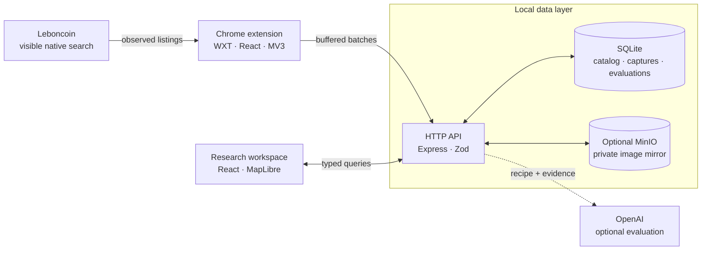

<p align="center">
  
</p>

<h1 align="center">dénicheur·breizh</h1>

<p align="center">
  <strong>Find a place. Keep the evidence.</strong><br>
  A local-first property research workspace for Brittany.<br>
  Capture listings, explore the map, and evaluate each property against what matters to you.
</p>

<p align="center">
  
  
  
  
</p>

<p align="center">
  <a href="#take-a-tour">Take a tour</a> ·
  <a href="#how-it-works">How it works</a> ·
  <a href="#quick-start">Quick start</a> ·
  <a href="#under-the-hood">Under the hood</a> ·
  <a href="#documentation">Documentation</a>
</p>



## A search worth keeping

A property search quickly becomes a pile of tabs: a promising house, an approximate location, a description you want to revisit, a price you remember differently.

**dénicheur·breizh turns those scattered observations into a research collection.** A Chrome extension captures Leboncoin listings through its visible search interface. A local workspace brings the photographs, structured details, source captures, and optional AI evaluations together. You can return to the evidence behind a listing instead of starting over.

The name pairs *dénicheur* — someone with a knack for finding hidden gems — with *Breizh*, the Breton name for Brittany.

## Take a tour

### From the collection to the details

Browse cards when photographs matter; switch to a sortable table when the numbers do. Open a listing without losing your place, expand its dossier, and move through the collection with the keyboard.



The dossier has three focused views:

| View | What it answers |
|---|---|
| **Overview** | What is advertised? Photographs, price, floor area, rooms, land, energy ratings, description, and source link. |
| **Evaluation** | How does this listing fit my criteria? Evaluation results, criterion verdicts, missing evidence, and supporting reasons. |
| **History** | What was captured, and when? Archived source observations, capture metadata, and the archived capture payload. |

Missing information stays missing. A later, sparse observation does not erase richer fields already collected.

### Put the search on the map

Explore Brittany with a MapLibre map, source and property-type filters, and a result list linked to the current view. Open a property preview directly from the map.



**Location precision is part of the evidence.** A locality-level coordinate is distinguished from a property-level coordinate. Listings without a usable location remain in the catalog, with map coverage made explicit.

### Make your criteria visible

The Builder makes evaluation rules inspectable: named criteria, weights, evidence instructions, and decision thresholds. Save immutable recipe versions, then combine selected versions into ordered evaluation plans.



Optional OpenAI evaluation applies those rules to the captured listing evidence. Results are stored locally with their recipe version and history; a failed evaluation never prevents a listing from being saved. The **Evaluations** view brings runs and their evaluation results together.

### A workspace that feels like one application

The web app and extension share a design system and **English, French, and Spanish** interface copy. Settings keeps language, light/dark appearance, and other global preferences in one place. Keyboard access, focus restoration, and responsive layouts are part of the shared experience.

<details>
<summary><strong>A closer look: the expanded dossier and the Builder</strong></summary>





</details>

<sub>Real application captures from a separate local preview. Listing text and photographs retain their source language; they are historical examples, not an availability feed. The Builder recipe is illustrative. GIFs step through actual UI states. See the [media workflow](docs/readme-media.md) for provenance and regeneration.</sub>

## How it works

**Search → Capture → Sync → Explore → Evaluate**

1. **Search in the browser.** Configure a collection in the Chrome extension. It opens the Leboncoin tabs it needs, fills the native search form, and follows native pagination.
2. **Capture what the source provides.** Page checkpoints and canonical listing IDs make a run traceable. Optional sequential detail-page visits collect richer evidence.
3. **Keep progress locally.** The extension buffers captures in `chrome.storage.local` and synchronizes idempotent batches to the API. Interrupted synchronization can be retried without duplicating the same source listing.
4. **Build a collection you can revisit.** SQLite holds the catalog, run observations, source-capture archive, recipes, plans, and evaluation history. The web app provides map, catalog, dossier, scoring, and builder views.
5. **Evaluate when useful.** The API can send the selected recipe and normalized evidence to OpenAI. Its key stays on the server, and provider calls are subject to execution and global resource budgets.

Collection is deliberately paced. A CAPTCHA pauses for the user; restriction or unusual-activity screens stop the run. The extension does not bypass site controls or automatically retry blocked pages.

## Quick start

You will need **Node.js 26**, **pnpm 12.7.0**, and **Chrome 116+** for the extension. The exact Node patch is pinned in [`.nvmrc`](.nvmrc).

```bash
git clone https://github.com/pablitxn/denicheur-breizh.git
cd denicheur-breizh

npm install --global pnpm@12.7.0
pnpm install
pnpm dev
```

Open **[the workspace](http://127.0.0.1:5173)**. The API listens on `http://127.0.0.1:4310`; [its health endpoint](http://127.0.0.1:4310/health) confirms readiness.

In another terminal, build the extension:

```bash
pnpm --filter @denicheur-breizh/extension build
```

Open `chrome://extensions`, enable **Developer mode**, choose **Load unpacked**, and select `apps/extension/.output/chrome-mv3`. Click the extension icon, choose **Open dashboard**, configure your search filters, and select **Start collection**. Captured listings appear in the workspace as they synchronize.

For extension development with a watcher, use `pnpm dev:extension` and load `apps/extension/.output/chrome-mv3-dev` instead.

> [!TIP]
> Capturing and exploring listings does not require an OpenAI key. To enable AI evaluation, copy `apps/api/.env.example` to `apps/api/.env` and set `OPENAI_API_KEY` there. Never put provider keys in `VITE_` or `WXT_` variables.

For configuration, optional local image storage, and reset commands, see [Local development](docs/local-development.md).

## Under the hood


```mermaid
flowchart LR
  source["Leboncoin<br/>visible native search"]
  extension["Chrome extension<br/>WXT · React · MV3"]
  web["Research workspace<br/>React · MapLibre"]

  subgraph local["Local data layer"]
    api["HTTP API<br/>Express · Zod"]
    db[("SQLite<br/>catalog · captures · evaluations")]
    media[("Optional MinIO<br/>private image mirror")]
  end

  ai["OpenAI<br/>optional evaluation"]

  source -->|"observed listings"| extension
  extension -->|"buffered batches"| api
  web <-->|"typed queries"| api
  api <--> db
  api <--> media
  api -.->|"recipe + evidence"| ai
```

The API is the only owner of SQLite. Shared Zod contracts connect the browser clients to the data layer; React components, design tokens, and translations live in shared packages.

| Layer | Built with |
|---|---|
| Research workspace | React 19, Vite, MapLibre, TanStack Query, Zustand |
| Capture extension | WXT, React, Chrome Manifest V3 |
| Data and evaluation | Express, SQLite, Zod, OpenAI; optional S3-compatible media storage |
| Shared foundation | TypeScript, pnpm workspaces, Turborepo, shared design system and i18n |
| Verification | Vitest, Playwright, API integration tests, built-extension E2E |

### Local-first, with explicit network boundaries

Research records live in your local database by default. This is **not a fully offline application**: collection accesses Leboncoin, the map loads OpenStreetMap tiles, and listing photos can load from their source until mirrored. Enabling AI evaluation sends the requested recipe and listing evidence to OpenAI.

The default API binds to loopback. Private deployment requires the authentication, persistent storage, and ingress configuration described in [Production and image provenance](docs/production.md). The repository's image verification pipeline does not itself deploy the application.

### Current scope and experiments

The working collection path is **Leboncoin → Chrome extension → local API → workspace**. A dossier currently represents one source listing. Unified physical-property identity, cross-source grouping, visits, editable personal documents, renovation budgets, and personal alerts belong to the [product roadmap](docs/property-dossier-product-model.md).

Two experiments live alongside that core:

- **Collector laboratory** — an isolated xAI / Firecrawl capture comparison, with its own frontend, API, SQLite, and evidence store. Start it with `pnpm dev:collector`; see the [lab guide](docs/collector-lab.md) and [evaluation methodology](docs/collector-evaluation.md).
- **Realtime voice** — a local, opt-in Spanish-to-French interpretation experiment. It requires both client and server opt-ins and is disabled in production; see [configuration](docs/local-development.md#optional-configuration).

## Development

```bash
pnpm check          # types, design tokens, unit/integration tests, production builds
pnpm test:e2e       # deterministic web + API + SQLite + Chrome extension flows
pnpm test:coverage  # per-package coverage summaries
pnpm check:all      # check + deterministic E2E
```

Deterministic E2E uses sanitized fixtures and does not spend OpenAI credits. Live provider validation and manual live-site smoke tests are separate, explicit workflows in the [development guide](docs/local-development.md#quality-gates).

```text
apps/
  web/                  Research workspace
  extension/            Native browser capture
  api/                  Catalog, archive, evaluation, and media
  collector-web/        Experimental capture comparison UI
  collector-api/        Isolated collector service
packages/
  contracts/            Shared application schemas
  collector-contracts/  Collector-specific schemas
  design-system/        Components, tokens, and shared settings
  i18n/                 French, Spanish, and English
```

## Documentation

| If you want to… | Start here |
|---|---|
| Run and configure the project | [Local development](docs/local-development.md) |
| Understand endpoints, storage, and budgets | [API reference](apps/api/README.md) |
| Configure private deployment and verified images | [Production and image provenance](docs/production.md) |
| Understand captured evidence and its limits | [Source-record archive](docs/source-record-archive.md) |
| Extend the shared preferences experience | [Settings contract](docs/settings-experience.md) |
| Explore the product direction | [Dossier product model](docs/property-dossier-product-model.md) · [UX roadmap](docs/ux-roadmap.md) |
| Work on the experimental collector | [Collector lab](docs/collector-lab.md) |
| Refresh the screenshots and GIFs | [README media workflow](docs/readme-media.md) |

---

<p align="center">
  <sub>Made for the search. Built around the evidence.</sub>
</p>
