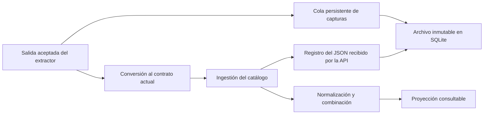

# Archivo de capturas y proyección del catálogo

Primera base implementada el 12/09/2026 para el [modelo de fichas y proyectos](property-dossier-product-model.md). El archivo conserva evidencia disponible; el catálogo sigue siendo la representación que usan hoy las búsquedas, el mapa y las evaluaciones.

## Separación implementada

Una captura y la proyección tienen ciclos de vida diferentes. Actualizar un precio crea evidencia adicional. Combinar datos para mostrar una ficha no modifica esa evidencia. Reiniciar la colección o limpiar el catálogo conserva el archivo y la cola de capturas aún no confirmadas.

## Qué significa original en esta entrega

| Tipo de registro | Frontera conservada |
|---|---|
| `extension-search-result` | Objeto de resultado aceptado por el runner, antes de convertirlo y combinarlo con los anuncios locales |
| `extension-detail` | Objeto de detalle aceptado por el runner, antes de convertirlo al contrato del catálogo |
| `api-ingestion` | Objeto de anuncio recibido por la API, antes de los ajustes del esquema y la combinación con otras observaciones |
| `legacy-run-snapshot` | JSON existente en `run_listings` al aplicar la migración 12; ya había sido normalizado y combinado |

Los dos primeros guardan `JSON.stringify` de la salida del extractor. Esto conserva campos todavía no modelados, valores nulos, orden de arrays y textos de ese objeto. El extractor existente puede haber seleccionado, combinado o recortado información al leer la página: esta entrega no recupera lo que desapareció antes de su salida aceptada. Tampoco guarda el HTML completo ni la respuesta de red del portal.

En la ingestión compatible se conserva el objeto JSON después del parser HTTP, no los bytes originales del cuerpo HTTP: espaciado entre claves o notación numérica del transporte pueden haber cambiado. Los espacios dentro de los valores se conservan. El registro sólo se confirma si la transacción de ingestión termina correctamente. La captura independiente de la extensión puede quedar archivada aunque la proyección posterior falle.

La migración no reconstruye capturas perdidas. Cada fila heredada se identifica como tal y conserva exactamente su `observation_json` disponible. Las URLs de fotografías incluidas en el JSON son evidencia de sus referencias; no garantizan conservar los archivos fotográficos. El almacenamiento y la limpieza de medios siguen su política actual.

## Identidad, fechas e integridad

Cada registro tiene ID, plataforma, identificador de publicación, corrida de origen, URL, tipo y versión del extractor cuando se conoce. `observedAt` indica cuándo se capturó; `receivedAt`, cuándo se archivó. Un envío pendiente puede llegar mucho después. La secuencia de archivo permite paginar sin confundir recepción con cronología de precios.

`payloadJson` se guarda sin volver a serializarlo y el servidor calcula SHA-256 sobre su texto UTF-8. El hash permite contrastar integridad del contenido; no certifica la veracidad de lo publicado. Los triggers de SQLite impiden actualizar o borrar filas mediante operaciones ordinarias.

Un ID repetido con el mismo contenido completo se confirma sin duplicar. Si ese ID llega con otro contenido o metadatos, se rechaza con conflicto y la transacción completa se revierte. La extensión genera un ID una sola vez al encolar; reintentar conserva ese ID. La compatibilidad de ingestión deriva su ID de corrida, identidad y payload, por lo que reenvíos idénticos no generan filas adicionales.

No hay claves foráneas desde el archivo hacia corridas, anuncios, medios o evaluaciones descartables. Se puede consultar el historial de una publicación aunque su fila del catálogo ya no exista. La persistencia depende de conservar y respaldar la base SQLite; la inmutabilidad de filas no sustituye un respaldo del archivo.

## Cola de la extensión

La cola guarda capturas antes de continuar la recopilación y es independiente de la lista local de anuncios y de su límite de 500 elementos. El envío usa la configuración y autenticación existentes del API, un registro por solicitud, y se dispara desde el ciclo de sincronización actual. Tiene una sola subida en curso por controlador y no demora la sincronización del catálogo, las evaluaciones ni la limpieza. Al primer fallo de un envío, ese ciclo conserva los pendientes y deja el reintento para una activación posterior.

El éxito confirma únicamente el registro enviado. Un fallo de red conserva la captura para reintentar. Los problemas de almacenamiento, datos de cola inválidos o tamaño se muestran como errores y detienen el avance que perdería evidencia; no se solucionan truncando el original. Los comandos de limpieza conservan esa cola pendiente y confirman su propio resultado aunque el archivo tenga un error de envío separado.

## API disponible

Se aplica la autenticación de operador existente y el bloqueo temporal durante mantenimiento.

| Operación | Resultado |
|---|---|
| `POST /v1/source-records` con `{records: [...]}` | Archiva entre 1 y 20 registros; devuelve `accepted`, `inserted`, `unchanged` |
| `GET /v1/source-records/:recordId` | Devuelve metadatos, hash y payload exacto de un registro |
| `GET /v1/listings/:source/:externalId/source-records?limit=20` | Página de metadatos, por secuencia de recepción descendente |
| Misma consulta con `beforeSequence` | Continúa desde `nextBeforeSequence`, sin cargar los payloads en la lista |

La admisión del endpoint de capturas limita cada `payloadJson` a 262.144 unidades de longitud JavaScript y el cuerpo HTTP a 1 MiB. El cuerpo JSON envuelve el payload serializado y puede ocupar más bytes. Un lote grande puede exceder el límite HTTP aunque sus elementos sean válidos; la extensión envía uno por vez. La lectura de registros existentes y el archivo interno de ingestiones ya admitidas no aplican ese límite nuevo, para conservar compatibilidad y acceso al histórico. Los límites HTTP de los demás endpoints permanecen intactos.

## Normalización actual y siguiente iteración

`apps/api/src/listingNormalization.ts` concentra la política actual y expone la referencia de código `listing-projection-v1`. La extracción del módulo preserva su comportamiento: eliminación de duplicados en arrays, combinación de textos, estado y elección de coordenadas. Su versión aún no se persiste por proyección.

El catálogo actual sigue identificado por plataforma e ID del anuncio, con observaciones combinadas por corrida. Todavía no representa una identidad física compartida entre portales. Tampoco se entrega un reprocesador automático del archivo: las salidas de extractor necesitan adaptadores explícitos, distintos del contrato de ingestión y de las copias heredadas.

Las siguientes entregas del modelo de producto deben añadir:

1. Interpretaciones versionadas que referencien sus capturas, con trazabilidad por campo y un reprocesado verificable.
2. Identidad del inmueble separada de sus publicaciones, con agrupaciones revisables y reversibles.
3. Aportes personales y profesionales independientes: visitas, documentos, presupuestos y correcciones atribuidas.
4. Historial visual de precios y discrepancias que use fecha de observación, distinga portales y no interprete ausencia de captura como retirada del anuncio.
5. Fichas, criterios, tiers y radar basados en esos datos y su evidencia, según el informe y modelo funcional previos.

Este archivo permite avanzar en esas capacidades conservando la evidencia disponible durante la evolución del producto.
